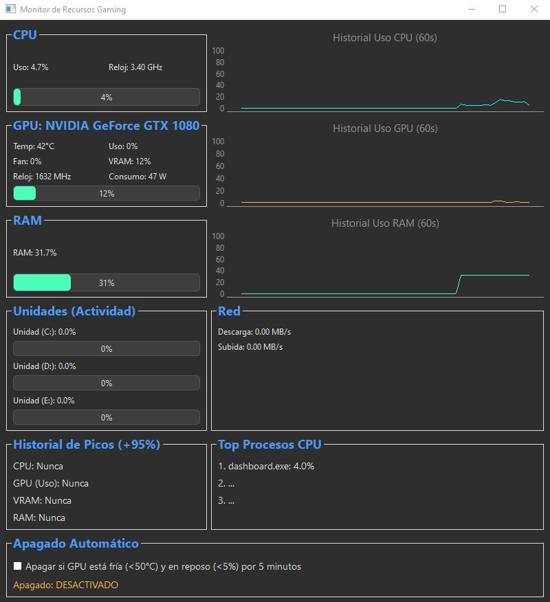

# Monitor de Recursos Gaming 🚀

Un dashboard de monitoreo de sistema en tiempo real, ligero y personalizable, diseñado para gamers y entusiastas del rendimiento. Está construido con Python y la biblioteca Qt (PyQt6).

Esta herramienta te permite vigilar todos los recursos vitales de tu sistema mientras juegas, ayudándote a diagnosticar cuellos de botella, *stuttering* (tirones) y problemas de rendimiento sin consumir apenas recursos.



## 📋 Características

El dashboard monitoriza los siguientes componentes en tiempo real:

* **💻 CPU:**
    * Uso actual del procesador (%).
    * Velocidad de reloj actual (GHz).
    * Gráfico de historial de uso de los últimos 60 segundos.

* **🎮 GPU (Solo NVIDIA):**
    * Temperatura (°C).
    * Uso del procesador gráfico (%).
    * Velocidad del ventilador (%).
    * Uso de VRAM (%).
    * Velocidad de reloj del núcleo (MHz).
    * Consumo de energía (W).
    * Barra de progreso de VRAM con código de color (Verde/Amarillo/Rojo).
    * Gráfico de historial de uso de los últimos 60 segundos.

* **🧠 RAM:**
    * Uso de RAM del sistema (%).
    * Gráfico de historial de uso de los últimos 60 segundos.

* **💾 Unidades (Discos):**
    * Detección automática de todas las unidades físicas (HDD/SSD).
    * Mapeo automático de letras (Ej: `Unidad (C:)`).
    * Porcentaje de **actividad** en tiempo real (0-100%).
    * Barra de progreso de actividad con código de color.

* **🌐 Red:**
    * Velocidad de descarga actual (MB/s).
    * Velocidad de subida actual (MB/s).

* **🕵️‍♂️ Diagnóstico (¡El "Chivato"!):**
    * **Top 3 Procesos:** Muestra los 3 procesos que más CPU están consumiendo (ignorando el "System Idle Process"). Ideal para cazar tirones causados por procesos en segundo plano.
    * **Historial de Picos (+95%):** Un contador que registra cuántas veces la CPU, GPU (Uso), VRAM o RAM han superado el 95% de uso durante la sesión.

* **⚙️ Utilidades:**
    * **Apagado Automático:** Un interruptor (ON/OFF) que apagará el PC de forma segura después de que el ventilador de la GPU haya estado a 0% durante 1 minuto (ideal para después de una sesión de juego).
    * **Scroll Integrado:** Toda la interfaz tiene un scroll vertical para adaptarse a cualquier tamaño de pantalla.
    * **Pausa al Arrastrar:** El refresco de datos se pausa automáticamente mientras mueves la ventana para evitar *lag* en la interfaz (similar al Administrador de Tareas de Windows).

---

## 🛑 Requisitos

* **Sistema Operativo:** **Windows**. (Debido al uso de `wmi` para la detección avanzada de discos).
* **GPU:** **NVIDIA**. (Debido al uso de `nvidia-ml-py` para los datos de la GPU).
* **Python:** 3.8 o superior.

---


## 🛠️ Instalación y Ejecución (Desde el Código)

Sigue estos pasos para ejecutar el dashboard desde el código fuente.

### 1. Clonar el Repositorio o descargarte el .ZIP
```bash
git clone https://github.com/CCDani/Monitor-de-Recursos-Gaming.git
```
cd Monitor-de-Recursos-Gaming

2. Crear un Entorno Virtual
Es una buena práctica crear un entorno virtual para aislar las dependencias del proyecto.


# Crea el entorno
```bash
python -m venv env
```

# Activa el entorno
```bash
.\env\Scripts\activate
```
3. Instalar las Dependencias
Con el entorno activado (env) >, instala todas las librerías necesarias usando el archivo requirements.txt.


```bash
pip install -r requirements.txt
```

4. Ejecutar el Dashboard

```bash
ppython dashboard.py
```

¡Ya está todo listo!


📦 Empaquetado (Crear un .exe independiente)
Si quieres convertir tu script en un archivo .exe que puedas ejecutar en cualquier PC con Windows sin necesidad de instalar Python, puedes usar PyInstaller.

1. Activa tu Entorno
Asegúrate de tener tu entorno virtual activado (paso 2) y pyinstaller instalado (debería estarlo si usaste el requirements.txt).

2. Ejecutar el Comando de PyInstaller
Para una aplicación tan compleja, un comando simple no es suficiente. Este comando incluye las importaciones ocultas (--hidden-import) que son necesarias para que PyQt, wmi y pynvml funcionen correctamente.

Ejecuta esto desde la raíz de tu proyecto (donde está el .py y el .ico):

```bash
pyinstaller --onefile --windowed --icon=icono.ico --hidden-import=pyqtgraph --hidden-import=wmi --hidden-import=pynvml dashboard.py
```

--onefile: Crea un único archivo .exe.

--windowed: Evita que se abra una consola negra detrás de tu dashboard.

--icon=icono.ico: Asigna tu icono al .exe.

--hidden-import=...: Fuerza la inclusión de las librerías que PyInstaller no puede encontrar por sí mismo.

3. ¡Listo!
PyInstaller trabajará durante unos minutos. Cuando termine, encontrarás tu ejecutable final en la carpeta dist/.


Tu dashboard.exe está listo para usarse.

